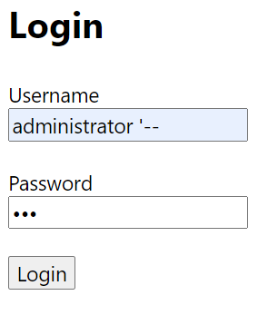
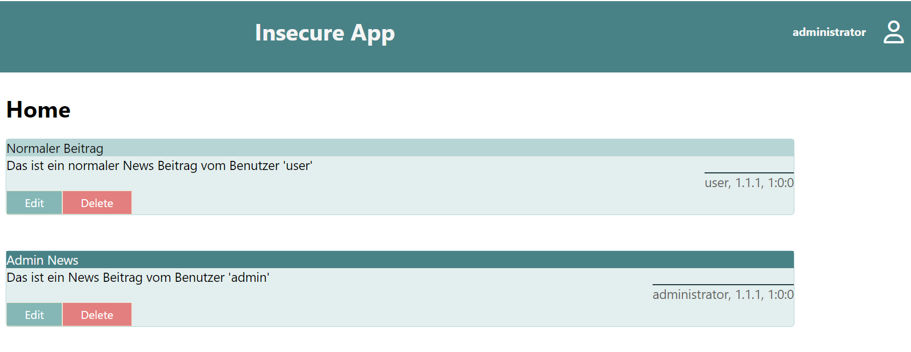
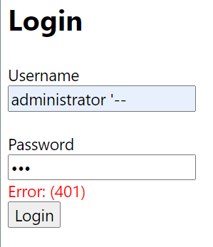
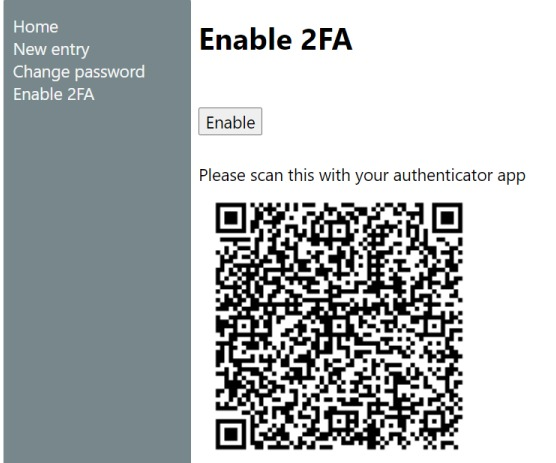
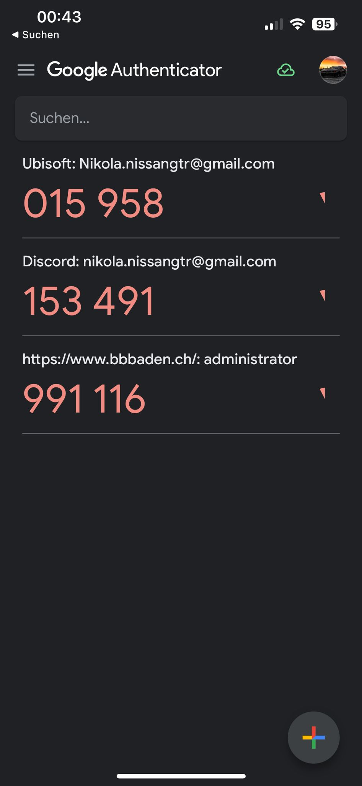
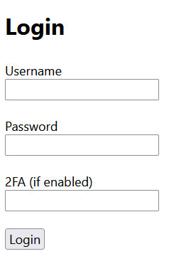

# Applikationssicherheit

## Einleitung

Dieses Portfolio präsentiert einen umfassenden Einblick in die Entwicklung und Implementierung von sicheren Web-Applikationen. Der Fokus liegt darauf, das Bewusstsein und Wissen über Cybersecurity zu erweitern, basierend auf den Erkenntnissen aus dem Modul 183 Applikationssicherheit implementieren. Ich gehen auf aktuelle, kritische Bedrohungen ein und erläutern anhand von Beispielen, wie Sicherheitslücken, insbesondere solche durch Injection, effektiv erkannt und behoben werden können. Die Bedeutung robuster Authentifizierungs- und Autorisierungsmechanismen. Zudem integriere ich Sicherheitsaspekte in der Software und diskutieren die Vorteile des defensiven Programmierens. Abschliessend wird die Wichtigkeit effektiver Auditing- und Logging-Verfahren beleuchtet, um die Applikationssicherheit kontinuierlich zu verbessern und zu gewährleisten.

## Schutzziele Beispiele

Hier sind drei Beispiele welche auf die Schutzziele von Vertraulichkeit, Integrität und Verfügbarkeit beurteilt werden. 

### Vertraulichkeit
Dieses Ziel stellt sicher, dass sensible Informationen nur von Personen eingesehen werden können, die auch wirklich dazu berechtigt sind. Man kann es sich wie einen versiegelten Brief vorstellen: nur der rechtmässige Empfänger darf ihn öffnen und lesen, alle anderen bleiben aussen vor.

### Integrität
Hier geht es darum, dass Daten unverändert und korrekt bleiben. Sie dürfen auf ihrem Weg vom Sender zum Empfänger – oder während sie gespeichert sind – nicht heimlich manipuliert, gelöscht oder ergänzt werden. Ein unverletztes Sicherheitssiegel auf einem Produkt veranschaulicht dieses Prinzip: solange das Siegel unbeschädigt ist, kann man sich darauf verlassen, dass der Inhalt original und unangetastet ist.

### Verfügbarkeit
Verfügbarkeit bedeutet, dass ein System oder eine Information genau dann erreichbar ist, wenn befugte Nutzer sie benötigen. Fällt der Dienst aus oder wird er blockiert, ist dieses Schutzziel verletzt. Man kann es mit Strom aus der Steckdose vergleichen: Man erwartet einfach, dass er da ist, sobald man das Licht einschaltet.

Die Schutzziele werden folgendermassen bewertet: 0 = gar nicht betroffen  |  1 = teilweise betroffen  |  2 = erheblich betroffen

1. SQL Injection auf Web Shop: Ein Angreifer schleust über ein fehlerhaftes Suchfeld eine UNION Query ein und liest dabei die Tabelle Customers (Namen, Adressen, Kreditkartentoken) aus.
Vertraulichkeit = 2
Integrität = 1 
Verfügbarkeit = 0
Kuerze Begründung: 
Primär wird der Schutz vor unbefugter Offenlegung verletzt. Die Datenbankstruktur bleibt weitgehend unverändert, die Shop‑Funktion ist weiterhin online.  

2. DDoS auf SaaS Plattform: Ein Bot überflutet den HTTPS Endpunkt mit Requests, sodass reguläre Nutzer mehrere Stunden lang keinen Zugang haben.
Vertraulichkeit = 0
Integrität = 0
Verfügbarkeit = 1
Kuerze Begründung:
Keine Daten­preisgabe und keine Daten­manipulation. Verfügbarkeit der Dienste ist jedoch massiv beeinträchtigt.

4. Insider ändert Lohn­daten: Ein Payroll‑Mitarbeiter mit Datenbank‑Zugriff manipuliert unbemerkt sein eigenes Gehalt in der Tabelle Salaries.
Vertraulichkeit = 0
Integrität = 2
Verfügbarkeit = 1 
Kuerze Begründung:
Keine externen Daten werden offengelegt. Die Korrektheit der Lohn­daten wird gravierend verletzt. Kurzzeitig kann es auch zu Ab­rech­nungs­fehlern kommen.

## Risikoanalyse 

### Szenario:
Ein Mitarbeitender vergisst seinen Firmen‑Laptop (mit lokal synchronisierten Kundendaten und VPN‑Zugang) im Zug. Das Gerät wird gestohlen und gelangt in die Hände eines Angreifers.

### Kriterium
Schaden (Impact) --> Hoch
Erläuterung: 
• Vertraulichkeit: Kundendaten könnten offengelegt werden.
• Integrität: Angreifer könnte Daten manipulieren, bevor sie erneut ins Firmennetz synchronisiert werden.
• Verfügbarkeit: Mitarbeitender kann vorübergehend nicht arbeiten, bis Ersatzgerät bereitsteht.

Eintrittswahrscheinlichkeit (Likelihood) --> Mittel 
Erläuterung:
• Mitarbeitende sind viel unterwegs (Aussendienst).
• In Zügen/Bahnhöfen kommt Diebstahl regelmäßig vor.
• Geräte sind zwar passwort , aber nicht immer fest verkettet.

### Umgang mit dem Risiko
1.	Festplatten Vollverschlüsselung (z. B. BitLocker) – verhindert Datenzugriff ohne Schlüssel.
2.	Mehrfaktor Anmeldung für VPN & lokale Entsperrung.
3.	Physische Sicherung: Kensington Schloss in Zügen/Besprechungsräumen fix verwenden.

### Beliebige Sicherheitslücke

Cross‑Site Scripting (XSS)
XSS entsteht, wenn eine Web‑Anwendung vom Benutzer gelieferten Text ungefiltert in eine Seite zurückschickt. Der eingeschleuste Text wird dann vom Browser der Opfer als JavaScript ausgeführt – Angreifer können damit Cookies stehlen, Sitzungen übernehmen oder beliebige Aktionen im Namen des Opfers ausführen.

OWASP‑Top‑Ten‑Kategorie: A03 – Injection (Unterform: Cross‑Site Scripting)

Passende CWE‑Nummern:
CWE‑79 – Improper Neutralization of Input During Web Page Generation (XSS)

#### Beurteilung der Umsetzung
Ich finde das ich das Artefakt gut umgesetzt habe und das Handlungsziel erreicht habe. 

## Sicherheitslücken und ihre Ursachen

In der Insecure App gibt es eine Sicherheitslücke bei der Verarbeitung der Logindaten. Man kann sich in der App mithilfe der SQL Injection als Administrator ausgeben ohne das nötige Passwort zu wissen und sich somit einloggen. Mit den Eingaben aus dem folgendem Bild kann man sich als Administrator einloggen. 



Und im zweiten Bild, sieht man jetzt wie man als Administrator eingeloggt ist.



### SQL-Injection im `LoginController`

Im `LoginController` wird folgender SQL-Befehl aus Benutzereingaben zusammengesetzt und ausgeführt:

```csharp
string sql = string.Format(
    "SELECT * FROM Users WHERE username = '{0}' AND password = '{1}'",
    request.Username,
    MD5Helper.ComputeMD5Hash(request.Password));
```

#### Angriffszenario

Der Angreifer kennt den Benutzernamen eines Administrators.
Input: `administrator' --`

Bei dieser Abfrage spielt es keine Rolle, welches Passwort zum jeweiligen Benutzer gehört. Entscheidend ist allein, dass der Benutzer existiert. Kennt der Angreifer den Benutzernamen eines Administrators, fügt er im Eingabefeld den Code '-- ein. Damit endet der SQL String und der Rest der Abfrage wird als Kommentar behandelt. Dann gibt er einen beliebigen Text als Passwort ein. Auf diese Weise erhält er die Rechte eines Administrators.

#### Verhindern

```csharp
string sql = "SELECT * FROM Users WHERE username = @username AND password = @password";

            var username = new SqlParameter("@username", request.Username);
            var password = new SqlParameter("@password", MD5Helper.ComputeMD5Hash(request.Password));

            var user = _context.Users
                .FromSqlRaw(sql, username, password)
                .FirstOrDefault();
```

Im folgenden Bild sieht man, dass nach der Behebung der Sicherheitslücke man keine SQL Injections mehr anwenden kann.




Bei parametrisierten Abfragen wird der SQL-Text (mit Platzhaltern wie `@username` und `@password`) vom Datenbank-Server **vorab kompiliert**. Die tatsächlichen Werte für Nutzername und Passwort werden **getrennt** als Parameter übergeben.  

 **SQL-Text** ist der Code und definiert Logik der Abfrage.  
 **Parameter** reine Daten die nicht als Code ausgeführt werden.

#### Beurteilung der Umsetzung
Ich finde ich habe das Artefakt gut umgesetzt und mein Handlungsziel erreicht habe. Die SQL Injection wurde ausführlich erklärt was es ist und wie diese im Code aussieht und wie man dieses Risiko beheben kann.

 ### JSON Web Token

Ein JSON Web Token (JWT) ist ein kompaktes Datenformat, mit dem man Informationen zwischen mehreren Parteien sicher übertragen kann.
Nach einer erfolgreichen Authentifizierung wird ein Token ausgestellt. Bei jeder Anfrage sendet der Client es im `Header: Authorization: Bearer <token>`
So muss nicht bei jeder Request Nutzername oder Passwort erneut übermittelt werden, da der Token alle nötigen Claims und das Ablaufdatum enthält.
Auf das Zwischenspeichern sensibler Daten im LocalStorage kann verzichtet werden.
Mehrere Dienste wie in einer Microservice-Architektur können denselben Token prüfen, solange sie den Signaturschlüssel kennen, und benötigen keine eigene Authentifizierung.

 1. **Header**  
     Sagt, dass es ein JWT ist und welcher Algorithmus verwendet wird (HS256).
  2. **Payload**  
     Enthält einfache Daten über den Nutzer (Benutzername, Ablaufzeit).
  3. **Signature**  
     Das Siegel das Header und Payload mit einem geheimen Schlüssel verknüpft.


(HEADER + PAYLOAD) -> Wird mit dem Geheimen Key verschlüsselt

**Warum kein Fälschen möglich ist**
- Ohne den geheimen Schlüssel ohne den geheimen Schlüssel gibt es keinen weg das Siegel zu berechnen.
- Bei änderungen des Headers oder des Payloads wird ein anderer Token generiert was.
- Das sorgt dafür, dass man mit einem gefälschten oder manipulierten JWT keinen Zugriff erhält.


#### LoginController.cs

 ```csharp
string sql = "SELECT * FROM Users WHERE username = @username AND password = @password";

            var username = new SqlParameter("@username", request.Username);
            var password = new SqlParameter("@password", MD5Helper.ComputeMD5Hash(request.Password));

            var user = _context.Users
                .FromSqlRaw(sql, username, password)
                .FirstOrDefault();
            if (user == null) return Unauthorized("login failed");


// Ab hier JWT relevant
            var jwtSection = _config.GetSection("Jwt");
            var keyBytes = Encoding.UTF8.GetBytes(jwtSection["Key"]);
            var creds = new SigningCredentials(
                                new SymmetricSecurityKey(keyBytes),
                                SecurityAlgorithms.HmacSha256);

            var claims = new[]
            {
                new Claim(ClaimTypes.NameIdentifier, user.Id.ToString()),
                new Claim(ClaimTypes.Name,           user.Username),
                new Claim("isAdmin",                 user.IsAdmin.ToString())
            };

            var token = new JwtSecurityToken(
                issuer: jwtSection["Issuer"],
                audience: jwtSection["Audience"],
                claims: claims,
                expires: DateTime.UtcNow.AddHours(1),
                signingCredentials: creds
            );

            var jwtToken = new JwtSecurityTokenHandler()
                                .WriteToken(token);

            return Ok(new
            {
                token = jwtToken,
                user = new
                {
                    Id = user.Id,
                    Username = user.Username,
                    IsAdmin = user.IsAdmin
                }
            });
```
bevor der Jwt Erstellt wird wird überprüft ob der nutzer korrekt ist also ob dieser in der Form des Nutzernamen und des Passworts so gefunden wird. Danach wird der Jwt erstellt wobei ich die nötigen infos in einen neuen Claim hinzufüge danach erstelle ich den Token mit den relevanten Daten also den Issuer in diesem fall Bbbaden und zugleich die audience welche auch Bbbaden ist und gebe den claim mit. Danach wird der Token mit den informationen verschlüsselt.

Für jeden Controller der nicht ohne eine solche authroisierung verwenden werden darf musste ich diesen Codeteil hinzufügen.

```csharp

[Route("api/[controller]")]
    [ApiController]
    [Authorize]// -> musste hinzugefügt werden


```


#### Programm.cs


```csharp
var jwtSection = builder.Configuration.GetSection("Jwt");
var key = Encoding.UTF8.GetBytes(jwtSection["Key"]);

builder.Services
    .AddAuthentication(options =>
    {
        options.DefaultAuthenticateScheme = JwtBearerDefaults.AuthenticationScheme;
        options.DefaultChallengeScheme = JwtBearerDefaults.AuthenticationScheme;
    })
    .AddJwtBearer(options =>
    {
        options.RequireHttpsMetadata = false;
        options.SaveToken = true;
        options.TokenValidationParameters = new TokenValidationParameters
        {
            ValidateIssuerSigningKey = true,
            IssuerSigningKey = new SymmetricSecurityKey(key),
            ValidateIssuer = true,
            ValidIssuer = jwtSection["Issuer"],
            ValidateAudience = true,
            ValidAudience = jwtSection["Audience"],
            ClockSkew = TimeSpan.Zero
        };
    });
```

Im Programm.cs habe ich die JWT-Middleware registriert, damit ASP .NET Core weiss, dass es eingehende Anfragen per Bearer-Token (JWT) authentifizieren soll. Dafür lade ich den geheimen Schlüssel aus der Konfiguration, um die Signatur des Tokens zu prüfen. Ausserdem lege ich fest, welche Claims (Issuer, Audience und Ablaufzeit) validiert werden müssen.
#### login.js


```js
function saveUser(response) {
  localStorage.setItem(userKey, JSON.stringify(response.user))
  localStorage.setItem('token', response.token)
} 

function authHeader() {
  const token = localStorage.getItem('token')
  return {
    Accept: 'application/json',
    'Content-Type': 'application/json',
    Authorization: token ? 'Bearer ' + token : '',
  }
}
```

hier musste ich bestimmen das der Token im localStorage gespeichert werden musste und auch auf diesen zugreifen danach habe ich in der authHeader funktion hinzugefügt wie die headers für die einzelnen abfragen aussehen mussten. 


## Authentifizierung implementieren

In der Insecure App geht es weiter mit der Authetifizierung. Vorhin hatten wir einen Fehler behoben bei der Authentifizierung. Jetzt geht es einen Schritt weiter. Anstatt das wir uns jetzt nur noch mit einem Benutzernamen und Passwort anmelden, verwenden wir eine 2-Faktor-Authentifizierung basierend auf der Google-Authenticator App. Jetzt kann man sich nicht mehr alleine mit dem Passwort anmelden, man benötigt dafür die App. In der App wird ein 6-stelliger Code generiert welchen man dann eingeben muss.

Damit die 2-Faktor-Authentifizierung genutzt werden kann, muss man auf "Enable 2FA" klicken, nachdem erhält man einen QR-Code welcher innerhalb der App gescannt werden muss. Nach dem Scannen befindet sich das Konto in der App und ein Code wird von nun an dort erstellt.



So sieht es in der Google-Authenticator App aus.



Jetzt kann man den Code aus der App nehmen und diesen in dem "2FA" Feld eingeben.



So sieht der Code aus für diese Funktion.

Enable 2FA in UserController

```csharp
[Authorize]                       // nur für eingeloggte Nutzer
[HttpPost("enable-2fa")]
public ActionResult<Auth2FADto> Enable2FA()
{
    var user = _context.Users.Find(_userService.GetUserId());
    if (user == null) return NotFound();

    if (!string.IsNullOrWhiteSpace(user.SecretKey2FA))
        return BadRequest("2-FA already enabled");

    var secret = Guid.NewGuid().ToString("N").Substring(0, 20);   // besser >80 Bit
    user.SecretKey2FA = secret;
    _context.SaveChanges();

    var issuer = _configuration["Jwt:Issuer"];
    var authenticator = new TwoFactorAuthenticator();
    var qr = authenticator.GenerateSetupCode(
                 issuer, user.Username, secret, false, 3);

    return Ok(new Auth2FADto { QrCodeSetupImageUrl = qr.QrCodeSetupImageUrl });
}
```

TOTP-Validierung in LoginController, innerhalb der Login-Methode

```csharp
if (!string.IsNullOrWhiteSpace(user.SecretKey2FA))
{
    var isValid = new TwoFactorAuthenticator()
                     .ValidateTwoFactorPIN(user.SecretKey2FA, request.TotpCode);

    if (!isValid)
        return Unauthorized("2-FA failed");
}
```

#### Beurteilung der Umsetzung
Ich finde das ich das Artefakt gut umgesetzt habe und das Handlungsziel erreicht habe. Die Authentifizierung und BrockenAccessControl wurden gut erklärt was ihre Aufgaben sind und wie man diese Implementiert.


## Sicherer Passwortwechsel & Passwort­richtlinien

### Warum ist es sinnvoll, beim Ändern des Passworts das alte Passwort abzufragen?

Identitätsnachweis: Nur wer das aktuell gültige Passwort kennt, kann beweisen, dass er tatsächlich Inhaber des Kontos ist. So werden unberechtigte Änderungen verhindert.

Schutz vor unbemerktem Konto­diebstahl: Selbst wenn jemand Zugriff auf eine eingeloggte Session bekommt, kann er ohne Kenntnis des alten Passworts das Login nicht dauerhaft übernehmen.

Vermeidung heimlicher Passwort-Resets: Viele Systeme erlauben Passwort-Reset per Mail oder SMS, falls diese Kanäle kompromittiert sind, könnte ein Angreifer sonst das Passwort zurücksetzen und das Konto übernehmen. Die Abfrage des alten Passworts stellt eine zusätzliche Hürde dar.

Benachrichtigung des echten Nutzers: Ein fehlgeschlagener Versuch, das alte Passwort einzugeben, kann als Warnsignal z. B. per E-Mail an den Kontoinhaber gemeldet werden.

### Eigene Passwortregeln und ihre Sicherheitswirkung

Regel
1. Mindest­länge 12 Zeichen
2. Mindestens ein Grossbuchstabe A–Z
3. Mindestens ein Kleinbuchstabe a–z
4. Mindestens eine Ziffer 0–9
5. Mindestens ein Sonderzeichen z. B. !@#$%^&*

Was bewirken diese Regeln? 
Durch Länge und Zeichensatz­vielfalt wächst die Passwort-Entropie und damit die Zeit, die ein Angreifer für vollständiges Durchprobieren benötigt. Ziffern und Sonderzeichen in Kombination mit Gross-/Klein Buchstaben zerstören einfache Wort- oder Phrase-Muster.

### Implementierung der Abfrage des alten Passworts

Hier sind die Folgenden Schritte welche im Backend und im Frontend umgesetzt wurden 

#### PasswordUpdateDto.cs

``` csharp
 public class PasswordUpdateDto
 {
     public int UserId { get; set; }
     public string OldPassword { get; set; }    // <<< NEU HIER
     public string NewPassword { get; set; }
     public bool IsAdmin { get; set; }
 }
```
Dieses DTO definiert, welche Informationen der Browser an den Server schickt, wenn jemand sein Passwort ändert. Neu ist das Feld `OldPassword` damit übermittelt der Benutzer nicht nur sein neues Passwort, sondern auch sein altes.

#### changePassword.js

In der Funktion `crateChangePasswordFrom()` habe ich folgende Änderungen hinzugefügt. 

```js
    /* unterhalb von Title. */

    /* Old Password. */                        // <<< NEU HIER
    var labelOld = document.createElement('label');
    labelOld.innerText = 'Old password';
    var inputOld = document.createElement('input');
    inputOld.id = 'oldPassword';
    inputOld.type = 'password';
    var divOld = document.createElement('div');
    divOld.appendChild(labelOld);
    divOld.innerHTML += '<br>';
    divOld.appendChild(inputOld);
    main.appendChild(divOld);

/* oberhalb von Password. */
```
Der JavaScript-Code erzeugt das zusätzliche Feld „Altes Passwort“ im Formular. `labelOld` ist die Beschriftung, inputOld ist das eigentliche Eingabefeld beides wird in die Seite eingebaut. Der Nutzer sieht nun drei Felder: „Altes Passwort“, „Neues Passwort“ und „Passwort bestätigen“.


Zu oberst in der Datei in der Funktion `onPasswordChange()` habe ich folgende Änderungen hinzugefügt. 

```js
 function onPasswordChange() {
     var inputOld = document.getElementById('oldPassword');    // <<< NEU HIER
     var inputPassword = document.getElementById('password');
     var inputConfirmPassword = document.getElementById('confirmPassword');

     if (!inputOld.value) {                                            // <<< NEU HIER
         toastr.warning('Old password cannot be empty', 'Warning');    // <<< NEU HIER
         return;                                                       // <<< NEU HIER
     }

     if (!inputPassword.value) {
         toastr.warning('Password cannot be empty', 'Warning');
     }
     else if (inputPassword.value != inputConfirmPassword.value) {
         toastr.warning('Passwords are not equal', 'Warning');
     }
     else {
         fetch('/api/User/password-update', {
             …
             body: JSON.stringify({
                 UserId: getUserid(),                     // <<< NEU HIER
                 OldPassword: inputOld.value,             // <<< NEU HIER
                 NewPassword: inputPassword.value,        // <<< NEU HIER
                 isAdmin: isAdmin()                       // <<< NEU HIER
             })
         })
```
Der Code holt den gerade eingegebenen Text aus dem neuen Feld. Ist das Feld leer, dann wird eine Warnmeldung eingeblendet und nichts weiter passiert. Beide Passwörter plus die User-ID werden in ein kleines Daten-Objekt verpackt und dieses Paket wird per HTTP-Aufruf (fetch) an den Backend-Endpunkt /api/User/password-update geschickt.

Damit es auch im Backend die Passwortregeln geprüft werden habe ich folgendes implementiert. 

#### UserController.cs
In der `PasswordUpdate` Action

```csharp
 public ActionResult PasswordUpdate(PasswordUpdateDto request)
 {
     if (request == null)
         return BadRequest();

     var user = _context.Users.Find(request.UserId);
     if (user == null)
         return NotFound(string.Format("User {0} not found", request.UserId));

     // 1) Altes Passwort prüfen                                        // <<< NEU HIER
     var oldHash = MD5Helper.ComputeMD5Hash(request.OldPassword);
     if (user.Password != oldHash)
         return BadRequest("Old password is incorrect.");               // <<< NEU HIER

     // 2) Neue Passwort‐Policy prüfen                                  // <<< NEU HIER
     var errors = new List<string>();
     if (request.NewPassword.Length < 12)
         errors.Add("Password must be at least 12 characters long.");
     if (!request.NewPassword.Any(char.IsUpper))
         errors.Add("Password must contain an uppercase letter.");
     if (!request.NewPassword.Any(char.IsLower))
         errors.Add("Password must contain a lowercase letter.");
     if (!request.NewPassword.Any(char.IsDigit))
         errors.Add("Password must contain a digit.");
     if (!Regex.IsMatch(request.NewPassword, @"[!@#$%^&*]"))
         errors.Add("Password must contain a special character (!@#$%^&*).");
     if (errors.Any())
         return BadRequest(string.Join(" ", errors));                    // <<< NEU HIER

     user.IsAdmin = request.IsAdmin;
     user.Password = MD5Helper.ComputeMD5Hash(request.NewPassword);

     _context.Users.Update(user);
     _context.SaveChanges();

     return Ok();
 }
```
Im Code passiert folgendes:
Das eingegebene alte Passwort wird in einen Hash verwandelt und mit dem in der Datenbank gespeicherten Hash verglichen. Stimmt es nicht, wird der Vorgang abgebrochen und eine Fehlermeldung zurückgeschickt.
Es wird geprüft, ob das neue Passwort mindestens 12 Zeichen hat, Gross-/Kleinbuchstaben, Ziffern und Sonderzeichen enthält. Jeder Regelverstoss landet in einer Liste von Fehlermeldungen. Gibt es Verletzungen, lehnt der Server die Änderung mit allen gesammelten Hinweisen ab. Nur wenn das alte Passwort korrekt ist und alle neuen Regeln erfüllt sind, wird das neue Passwort gehasht und in der Datenbank gespeichert.

## Logging-Konzept & ­Implementierung

### Logging-Konzept

In der Insecure App werden alle sicherheitsrelevanten und betrieblichen Ereignisse systematisch protokolliert. Jede Log-Zeile enthält einen ISO-Timestamp, den vollständigen Logger-Namen , das Log-Level und eine aussagekräftige Nachricht. Die Logs werden gleichzeitig in der Konsole und in Log-Dateien gespeichert und können bei Bedarf an ein zentrales Log-Management weitergeleitet werden.

#### Log-Events und Level

Login erfolgreich (Information)
Wird protokolliert, wenn sich ein Benutzer mit korrekten Zugangsdaten anmeldet.

Login fehlgeschlagen (Warning)
Bei jedem fehlgeschlagenen Login-Versuch zur Erkennung von Brute-Force-Angriffen.

Passwortänderung gestartet (Information)
Wenn ein Benutzer die Passwort Änderung initiiert (API-Aufruf).

Passwortänderung fehlgeschlagen (Warning)
Falls die alte Passwort-Verifikation oder die neuen Passwortregeln nicht erfüllt werden.

Passwortänderung erfolgreich (Information)
Nach erfolgreicher Änderung und Speicherung des neuen Passwort-Hashes.

2FA-Aktivierung erfolgreich (Information)
Wenn der Benutzer die Zwei-Faktor-Authentifizierung initial einrichtet.

2FA-Validierung fehlgeschlagen (Warning)
Bei ungültigem TOTP-Code oder abgelaufenem Token.

Ungültiges JWT-Token / Autorisierungsfehler (Warning)
Bei Zugriff mit fehlendem oder manipuliertem Token.

Admin-Aktionen (News Create/Edit/Delete) (Information)
Dokumentation aller administrativen Änderungen im System.

Unerlaubter Admin-Zugriff (Warning)
Wenn ein nicht-berechtigter Benutzer versucht, administrative Endpunkte aufzurufen.

Systemfehler / Datenbank-Fehler (Critical)
Bei Ausnahmen in globalen Error-Handlern oder schwerwiegenden DB-Problemen.

#### Logging-Framework initialisieren `Program.cs`

```csharp
var builder = WebApplication.CreateBuilder(args);

// bisherige Konfiguration…

 // Logging-Konfiguration                     // <<< NEU HIER
 builder.Host.ConfigureLogging(logging =>
 {
     logging.ClearProviders();
     logging.AddConsole();
     logging.AddFile("Logs/insecureapp-{Date}.txt");    
     logging.SetMinimumLevel(LogLevel.Information);
 });

var app = builder.Build();
```
#### Logging-Statements an den Stellen aus dem Konzept

In der Datei `LoginController.cs` Methode `public ActionResult<User> Login(LoginDto request)`

```csharp
     if (user == null)
     {
        _logger.LogWarning("Login failed for user '{Username}'", request.Username);
        return Unauthorized("Login failed");
     }

     _logger.LogInformation("Login successful for user '{Username}'", request.Username);
     return Ok(CreateToken(user));
```

#### Beurteilung der Umsetzung
Ich finde das ich das Artefakt teilweise gut erlediegt habe. Ich würde sagen das noch etwas Code fehlt der Log-Events


## Selbsteinsschätzung

In meiner Selbsteinschätzung zum Modul Cybersecurity empfand ich grosse Vorfreude und Interesse, stiess jedoch auf einige Herausforderungen im Verständnis des Stoffs. Die Art der Leistungsbeurteilung war sehr hilfreich, um den Stoff zu wiederholen und besser zu verstehen. Obwohl ich nicht alle Aufgaben absolvierte, glaube ich, dass ich das Wesentliche verstanden habe. Meine Leistung während des Modul war einiger Massen in Ordnung. Es gab Inhalte welche einfach waren und welche wofür ich viel Zeit aufwenden musste um diese zu verstehen. Die meisten Kompetenzen des Moduls habe ich erreicht, insbesondere im Bereich der Sicherheitsaspekte und der defensiven Programmierung
